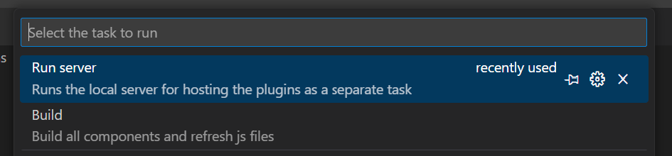
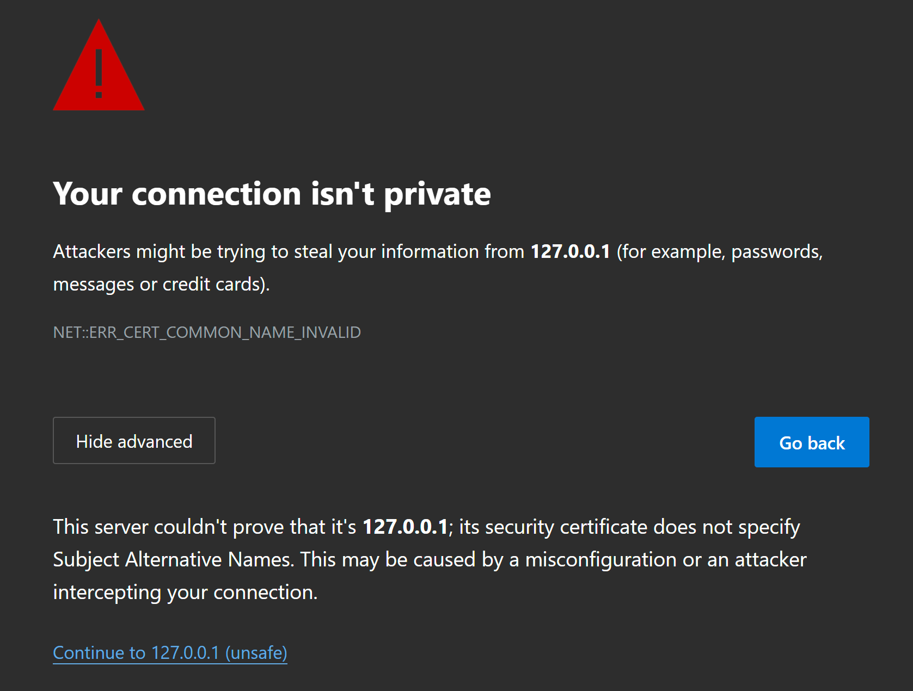
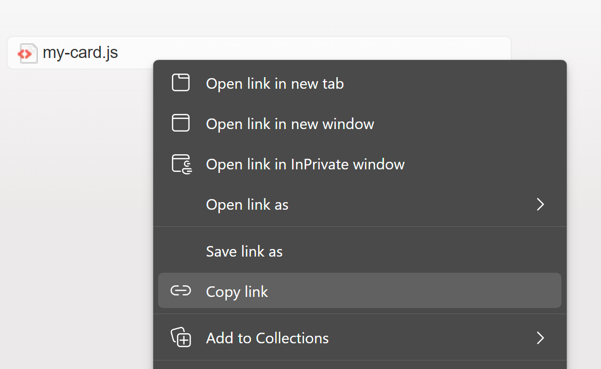
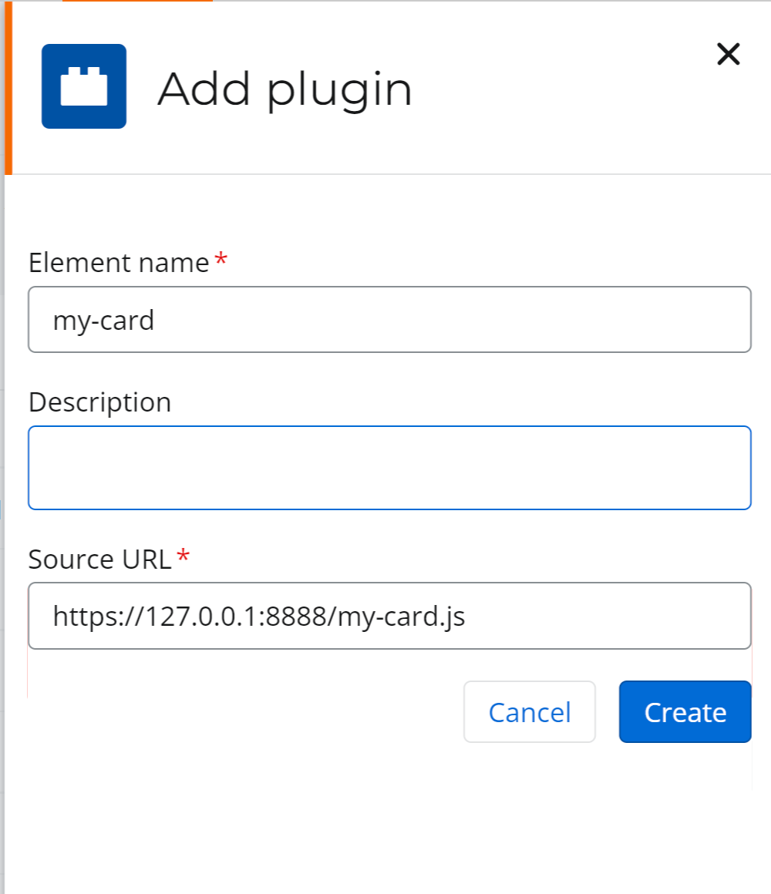
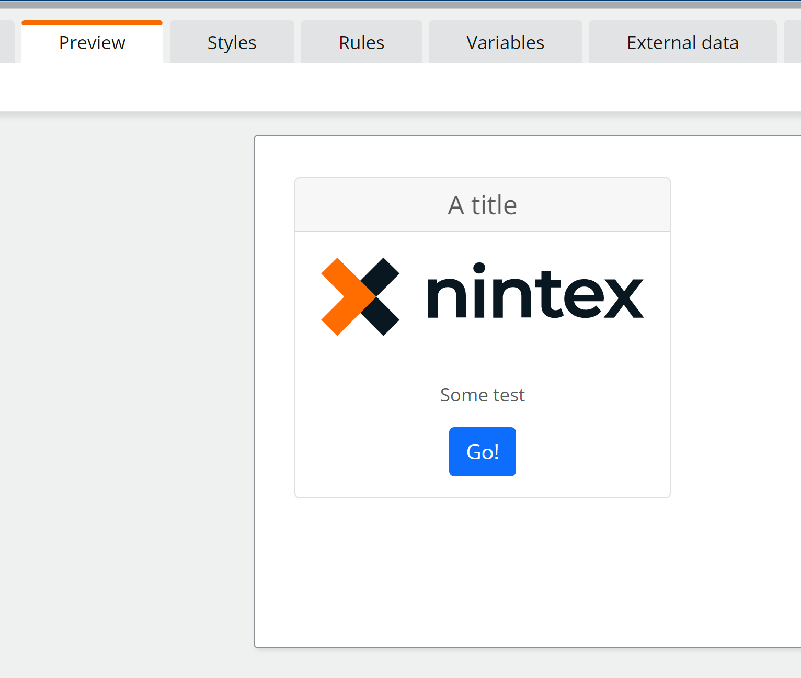
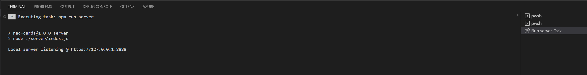

# Self-host and debug plugins

## Self-host

1. On the VS Code menu bar, go to Terminal > Run Task and select the **Run Server** task

2. On the browser window, click the Advanced button and then the Continue to 127.0.0.1 (unsafe) link

3. Each component will be compiled as a separate js file. Right click and copy the link to the plugin you want to register.

4. On your NAC tenant's Form plugins section, add your plugin using the copied link.

5. Validate that the plugin is workign by adding it to a new form

 
## Change and deploy

1. Update your typescript code
   
2. On a VS Code terminal, type **npm run build**, or run the Build task (Menu Bar > Terminal > Run Task and select the **Build** task)
   
3. Make sure the server is running

1. Close and reopen the form

